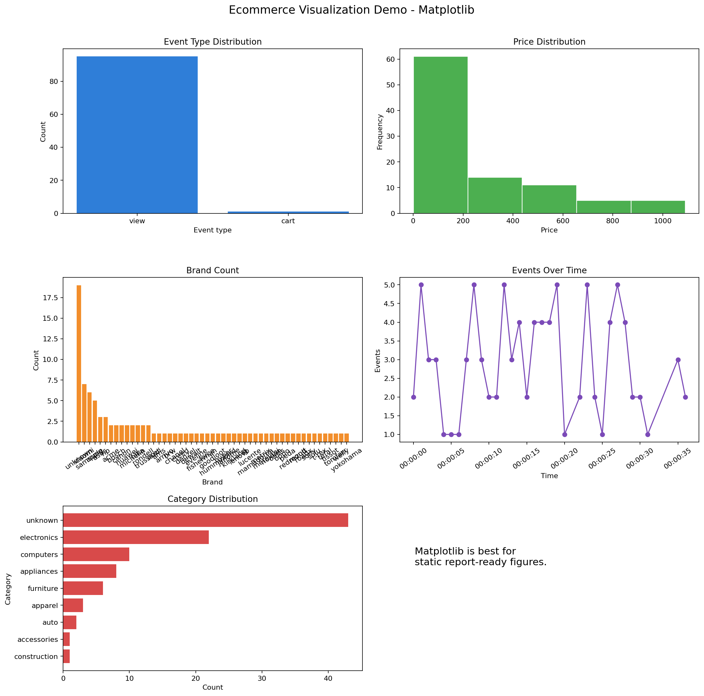
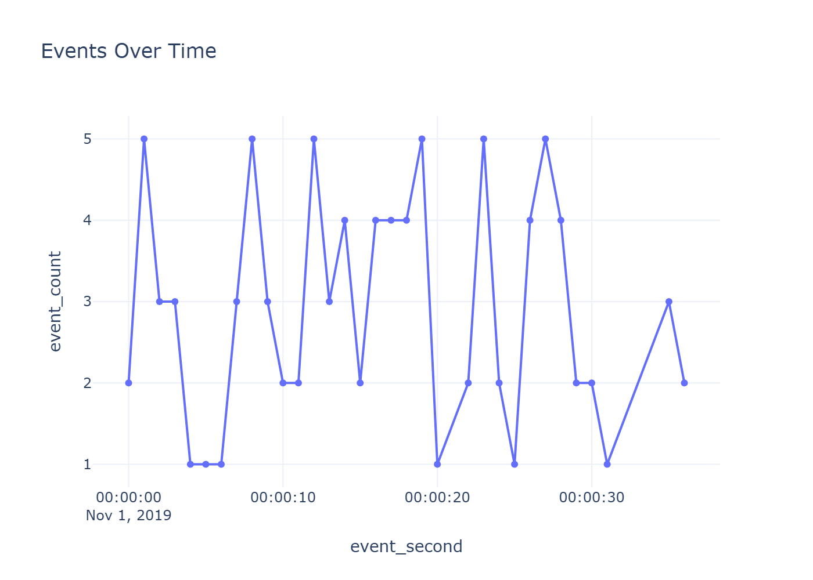
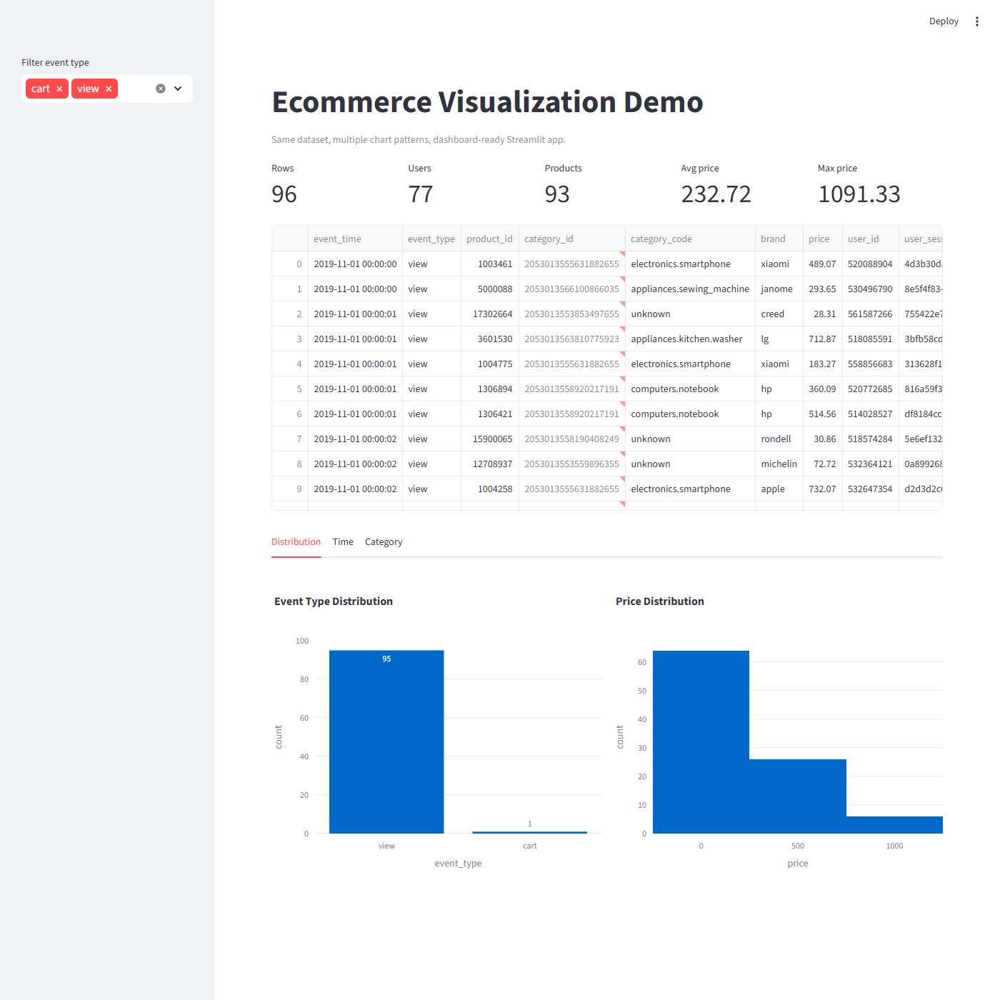
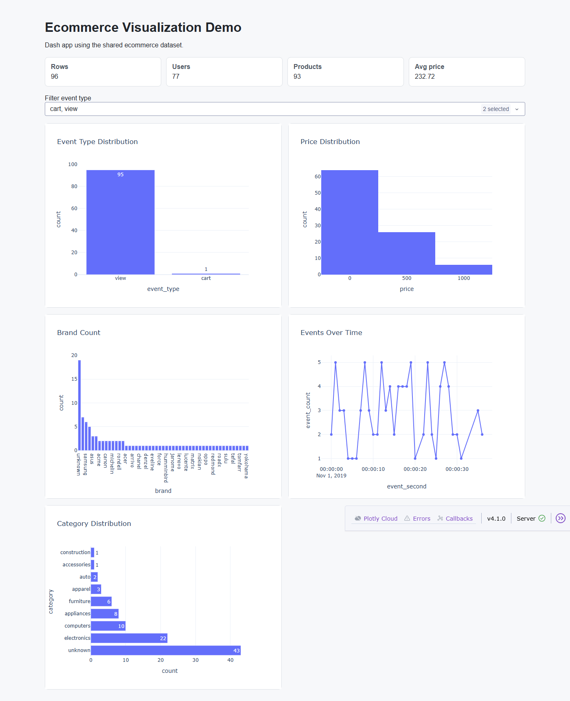
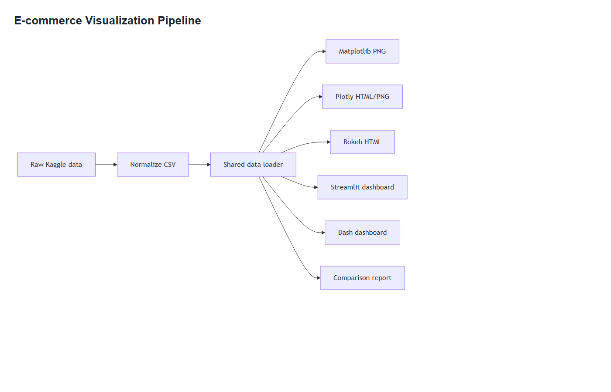
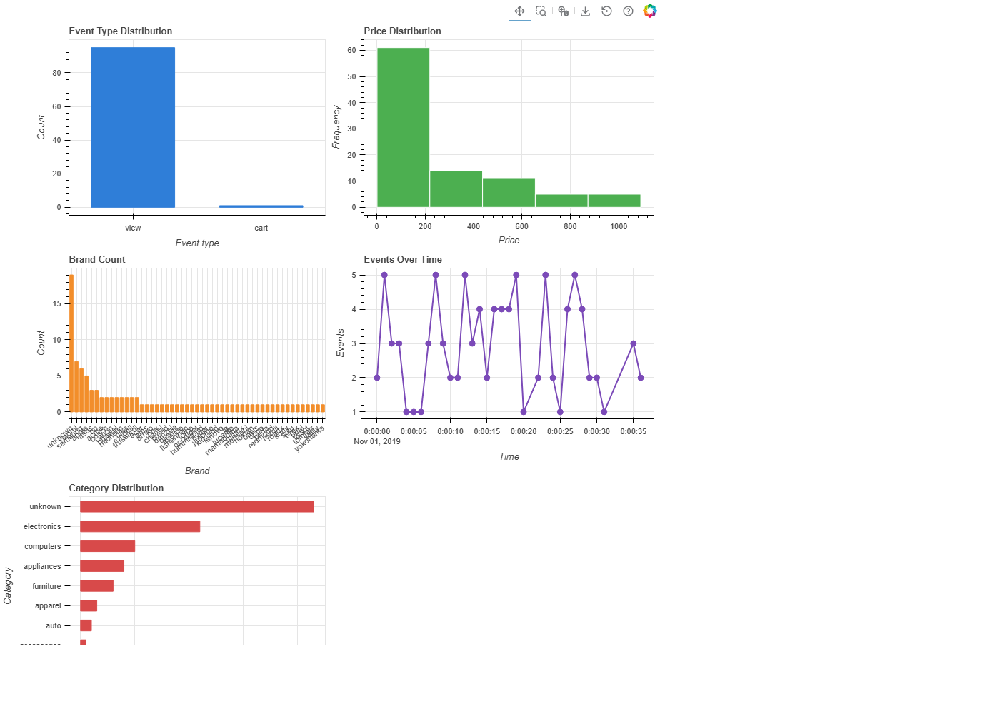

# Data Visualization Tool Comparison Report

## 1. Mục tiêu

Project này thử nghiệm nhiều tool visualization trên cùng một dataset e-commerce nhỏ để so sánh khả năng sử dụng trong phân tích dữ liệu, báo cáo, web demo và dashboard.

Dataset clean: `data/ecommerce_events_clean.csv`

Các chart đã thử:

- Event type distribution
- Price distribution
- Brand count
- Events over time
- Category distribution

Vì dataset nhỏ và phép tổng hợp khá đơn giản, nhiều biểu đồ nhìn gần giống nhau. Điều này không có nghĩa các tool giống nhau. Khác biệt chính nằm ở khả năng kỹ thuật: static export, interactivity, web integration, dashboard, customization và mức phù hợp trong thực tế.

## 2. Kết quả minh họa theo tool

### Matplotlib

Matplotlib phù hợp nhất cho ảnh tĩnh trong báo cáo, PDF hoặc slide. Điểm mạnh là kiểm soát chi tiết tốt, export PNG ổn định, dễ dùng trong báo cáo học thuật. Điểm yếu là gần như không có tương tác nếu chỉ dùng ảnh tĩnh.

### Plotly

Plotly mạnh nhất ở interactive chart. Chart có hover, zoom, pan, legend toggle và có thể export HTML/PNG. Với ảnh tĩnh, output có thể giống Matplotlib, nhưng khi mở HTML thì trải nghiệm khác rõ rệt.

### Streamlit

Streamlit phù hợp để làm web demo nhanh. Chỉ cần Python là có dashboard với filter, metric, bảng dữ liệu và chart tương tác. Điểm yếu là UI tùy biến không sâu bằng Dash hoặc frontend riêng.

### Dash

Dash phù hợp dashboard chuyên nghiệp hơn Streamlit. Nó có callback rõ ràng, layout có cấu trúc và dễ mở rộng khi app có nhiều filter hoặc nhiều chart liên kết. Đổi lại, code dài hơn và learning curve cao hơn.

### Mermaid.js

Mermaid không phải tool chính để vẽ chart dữ liệu. Nó phù hợp nhất để mô tả pipeline, architecture, flowchart hoặc diagram trong tài liệu kỹ thuật.

### Bokeh

Bokeh tạo interactive chart trên browser và xuất HTML độc lập tốt. Tuy nhiên, với project nhỏ này, Plotly thực tế hơn vì dễ học hơn, phổ biến hơn và tích hợp tốt với Dash/Streamlit.

## 3. So sánh nhanh

| Tool | Ease | Interactive | Web | Dashboard | Custom | Độ đẹp | Best Use Case |
|------|------|-------------|-----|-----------|--------|--------|---------------|
| Matplotlib | Medium | Low | Low | Low | Very high | Đẹp cho PDF/report | Static chart, học thuật, báo cáo |
| Plotly | High | Very high | Very high | Medium | High | Đẹp cho chart web | Interactive chart, HTML demo |
| Streamlit | Very high | High | High | High | Medium | Đẹp cho demo nhanh | Prototype dashboard, data app |
| Dash | Medium | Very high | Very high | Very high | Very high | Đẹp nếu đầu tư UI | Dashboard chuyên nghiệp |
| Mermaid.js | High | Low | High | Low | Medium | Đẹp cho diagram | Pipeline, architecture docs |
| Bokeh | Medium | High | High | Medium | High | Khá tốt trên browser | Interactive HTML chart |

## 4. Nhận xét chính

### Ease of Use

Streamlit dễ nhất để tạo dashboard nhanh. Plotly dễ nhất để tạo interactive chart. Dash và Bokeh cần nhiều cấu hình hơn. Matplotlib dễ bắt đầu nhưng code dài hơn khi có nhiều subplot.

### Static Visualization

Matplotlib tốt nhất cho ảnh tĩnh vì export ổn định và kiểm soát chi tiết tốt. Plotly cũng xuất PNG được, nhưng bản chất mạnh hơn ở HTML interactive.

### Interactivity

Plotly tốt nhất cho chart tương tác đơn lẻ. Dash tốt nhất cho dashboard nhiều callback. Streamlit tốt nhất cho demo tương tác nhanh. Matplotlib và Mermaid gần như không phù hợp cho tương tác dữ liệu.

### Web Integration

Dash mạnh nhất nếu cần dashboard web nghiêm túc. Streamlit nhanh nhất để demo. Plotly dễ nhúng HTML. Bokeh cũng xuất HTML tốt nhưng ít phổ biến hơn Plotly trong workflow hiện đại.

### Độ đẹp

Không thể nói chung chung tool nào đẹp nhất. Với PDF/report, Matplotlib đẹp và rõ nhất nếu tinh chỉnh tốt. Với web chart, Plotly hiện đại hơn nhờ hover và zoom. Với demo nhanh, Streamlit đẹp vì có sẵn layout app. Với dashboard production, Dash đẹp nhất nếu đầu tư CSS/layout. Với tài liệu kỹ thuật, Mermaid đẹp nhất cho sơ đồ luồng xử lý.

## 5. Recommendation

| Mục đích | Tool nên dùng |
|---------|---------------|
| Học và báo cáo PDF | Matplotlib |
| Interactive chart | Plotly |
| Web demo nhanh | Streamlit + Plotly |
| Dashboard chuyên nghiệp | Dash + Plotly |
| Diagram / mô tả hệ thống | Mermaid.js |
| Interactive HTML thay thế | Bokeh |

Nếu làm project AI/Data Analytics thực tế:

- Giai đoạn explore data: dùng Matplotlib + Plotly.
- Giai đoạn demo: dùng Streamlit + Plotly.
- Giai đoạn production dashboard: dùng Dash + Plotly.
- Giai đoạn documentation: dùng Mermaid.js.

## 6. Kết luận

Visualization tools không nên được đánh giá chỉ bằng hình ảnh cuối cùng, đặc biệt với dataset nhỏ. Khi dữ liệu đơn giản, chart giữa các tool có thể nhìn giống nhau vì chúng đang biểu diễn cùng một phép tổng hợp. Giá trị thật sự của tool nằm ở khả năng mở rộng, mức độ tương tác, khả năng tích hợp web, dashboard support và mức phù hợp với workflow thực tế.

Với project này, lựa chọn thực tế nhất là: Matplotlib cho báo cáo tĩnh, Plotly cho interactive chart, Streamlit cho demo nhanh, Dash cho dashboard chuyên nghiệp và Mermaid cho tài liệu kỹ thuật.
