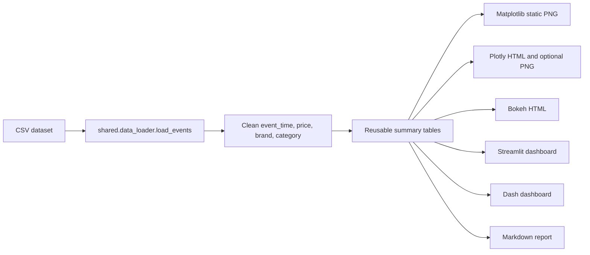
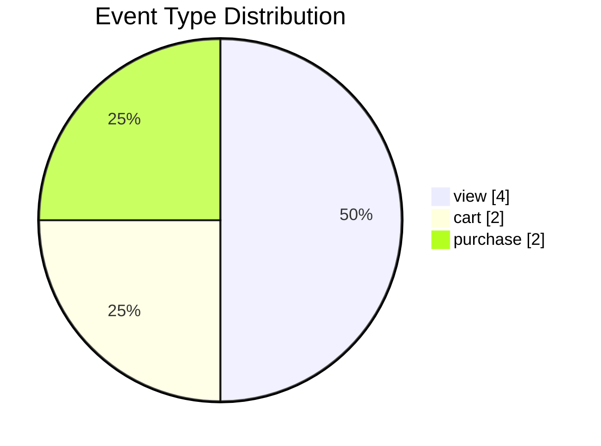
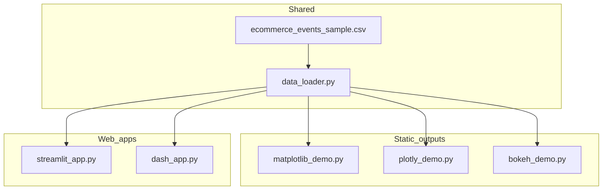

# Mermaid Examples

Mermaid is included here as a documentation and architecture visualization tool. It can draw simple pie charts from prepared counts, but it is not a full data visualization library like Matplotlib, Plotly, Bokeh, Dash, or Streamlit.

## Data Processing Flow

## Event Type Distribution

## Demo Architecture

